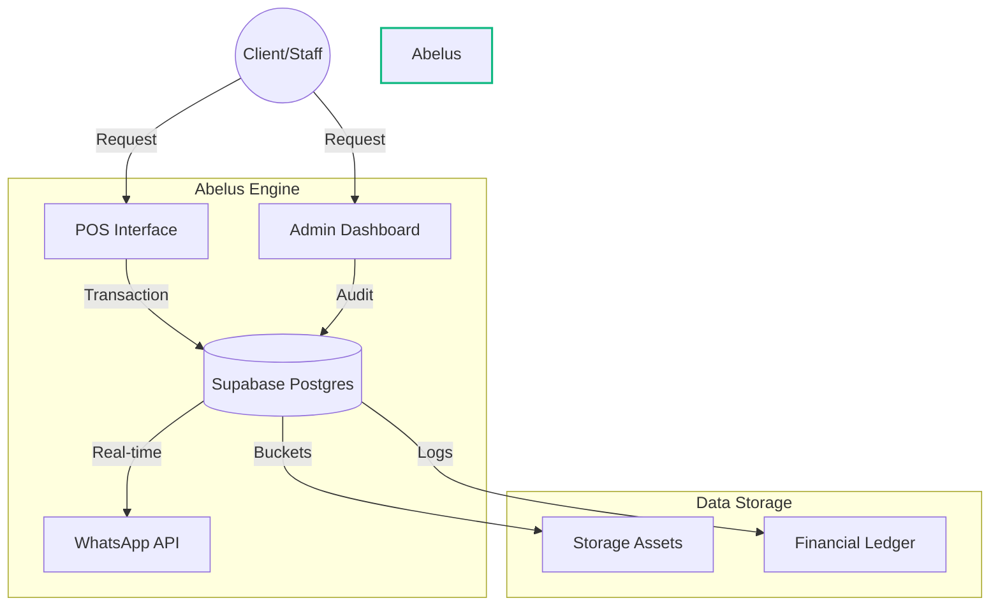

# 🌌 ABELUS | The Unified Enterprise Operating System

<div align="center">

```text
      ___           ___           ___           ___           ___           ___     
     /\  \         /\  \         /\  \         /\__\         /\  \         /\  \    
    /::\  \       /::\  \       /::\  \       /:/  /        /::\  \       /::\  \   
   /:/\:\  \     /:/\:\  \     /:/\:\  \     /:/  /        /:/\:\  \     /:/\:\  \  
  /::\~\:\  \   /::\~\:\  \   /::\~\:\  \   /:/  /        /::\~\:\  \   /:/  /::\  \ 
 /:/\:\ \:\__\ /:/\:\ \:\__\ /:/\:\ \:\__\ /:/__/        /:/\:\ \:\__\ /:/__/ \:\__\
 \/__\:\/:/  / \/__\:\/:/  / \/__\:\/:/  / \:\  \        \/__\:\/:/  / \:\  \  \/__/
      \::/  /       \::/  /       \::/  /   \:\  \            \::/  /   \:\  \      
      /:/  /        /:/  /        /:/  /     \:\  \           /:/  /     \:\  \     
     /:/  /        /:/  /        /:/  /       \:\__\         /:/  /       \:\__\    
     \/__/         \/__/         \/__/         \/__/         \/__/         \/__/    
```

**[ Pharmacy • Retail POS • Print Management • Financial Intelligence ]**

[](https://nextjs.org/)
[](https://supabase.com/)
[](https://tailwindcss.com/)
[](https://framer.com/motion)

</div>

---

## 💎 The Vision
**Abelus** is a high-performance, professional-grade management ecosystem designed for modern Rwandan enterprises. Built with a "surgical" UI aesthetic and high-density information architecture, it unifies retail operations, pharmaceutical stock management, and custom service auditing into a single source of truth.

---

## 🛠️ Core Modules

### 💊 1. Executive Pharmacy Dashboard
A clinical-grade interface for managing health inventory.
- **Granular Tracking**: Real-time stock alerts and expiration monitoring.
- **Procurement Engine**: Automated stock replenishment workflows.
- **Prescription Ledger**: Encrypted medication history tracking.

### 🛒 2. Dynamic Retail POS
A sleek, high-speed Point of Sale optimized for any device.
- **Smart Checkout**: Support for Cash, MoMo, and Credit workflows.
- **Contract Pricing**: Client-specific negotiated rates injected at point-of-sale.
- **Responsive Ledger**: Real-time sales visualization and staff performance metrics.

### 🖨️ 3. Print Audit Workstation
The ultimate engine for custom printing services.
- **Integrated Audit Node**: Pop-up workstation for B&W/Color auditing.
- **Universal Editable Rates**: Real-time yield calculation for Pages, Binding, and Editing.
- **WhatsApp Automation**: Kinyarwanda-localized client status notifications via one-click API.

### 📈 4. Financial Intelligence
Actionable data to drive business growth.
- **Universal Tracking**: Every transaction linked via `tracking_id` across POS and Online channels.
- **Dynamic P&L**: Automated revenue breakdowns by category and staff.
- **Debt Management**: Automated balance tracking for contract clients.

---

## 📐 System Architecture



---

## 🚀 Technology Stack
- **Framework**: [Next.js 14+](https://nextjs.org/) (App Router)
- **Styling**: [Tailwind CSS](https://tailwindcss.com/) (Emerald/Slate Design System)
- **Backend / Auth**: [Supabase](https://supabase.com/)
- **Animations**: [Framer Motion](https://framer.com/motion)
- **Icons**: [Lucide React](https://lucide.dev/)

---

## ⚙️ Quick Start

### 1. Clone the repository
```bash
git clone https://github.com/Benitgilbert/Abelus.git
```

### 2. Environment Setup
Create a `.env.local` file with your credentials:
```env
NEXT_PUBLIC_SUPABASE_URL=your_url
NEXT_PUBLIC_SUPABASE_ANON_KEY=your_key
```

### 3. Launch Development
```bash
npm install
npm run dev
```

---

<div align="center">
Built with ❤️ by <b>Antigravity</b> for <b>Abelus Enterprise</b>
</div>
